# 🏨 Hostel Management System

A web-based Hostel Management System designed to streamline hostel admission, room allocation, payment handling, and communication between students and hostel administration.

---

## 🌐 Live Demo

🔗 [Live Site](https://hostel-management-system.infinityfreeapp.com/)

You can explore the functionalities as a **student** or **admin** through the live demo.

---

## 📌 Features

### 👨‍🎓 Student Panel
- Apply for hostel admission.
- Email verification via verification link.
- Wait for admin approval (notified via email).
- After approval and check-in, access full system features:
  - Login to student dashboard.
  - Check application status before login.
  - Reset password via email link.
  - Edit profile and upload profile image.
  - Change password.
  - Send room change requests.
  - File complaints and chat with admin.
  - Make payments (manual match via mobile banking).
  - Print receipts and monthly payment reports.
  - Overpayment is auto-adjusted to the next month.
  - View room details and roommate list.

### 🛠️ Admin Panel
- Admin and Super Admin roles:
  - Super Admin can manage all admins.
- Manage:
  - Hostels
  - Floors
  - Rooms and room types
  - Student profiles (approve, verify, check-in)
  - Room assignments
- Payment Management:
  - Generate monthly payments.
  - Auto late fee addition after due date.
  - Download reports in PDF or CSV format.
  - Match mobile banking payments via transaction ID and reference code.
- Complaint Management:
  - Respond to student complaints via chat.
- Handle room change requests.

---

## 🧰 Tech Stack

- **Backend:** PHP  
- **Frontend:** HTML, CSS, Bootstrap  
- **Interactivity:** jQuery, AJAX  
- **Database:** MySQL  

---

## 📸 Screenshots

### Landing Page

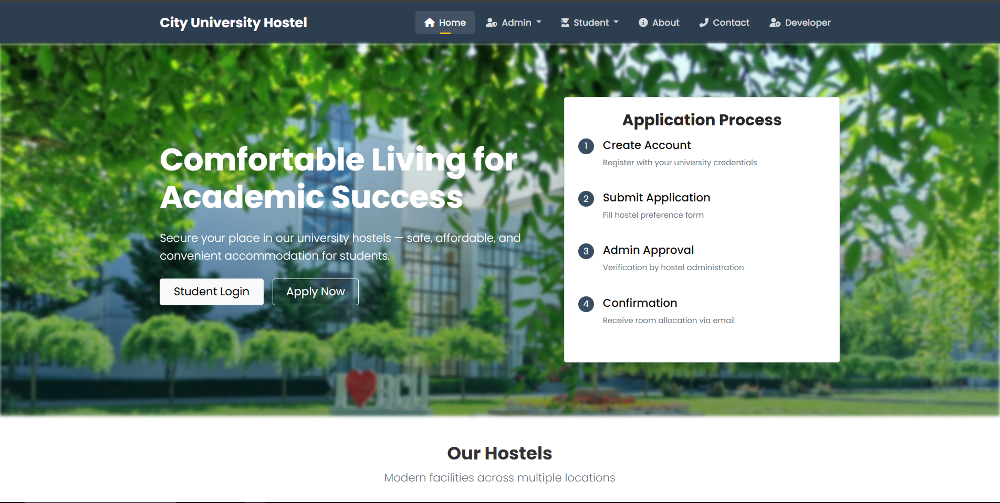

### Check Status After Hostel Apply

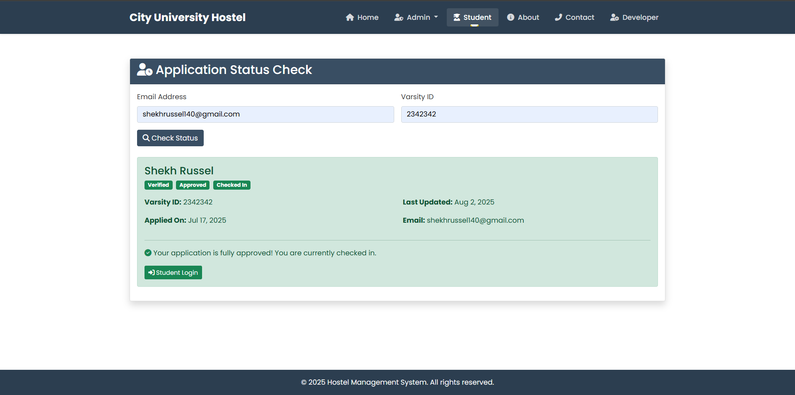

### 👨‍🎓 Student Dashboard

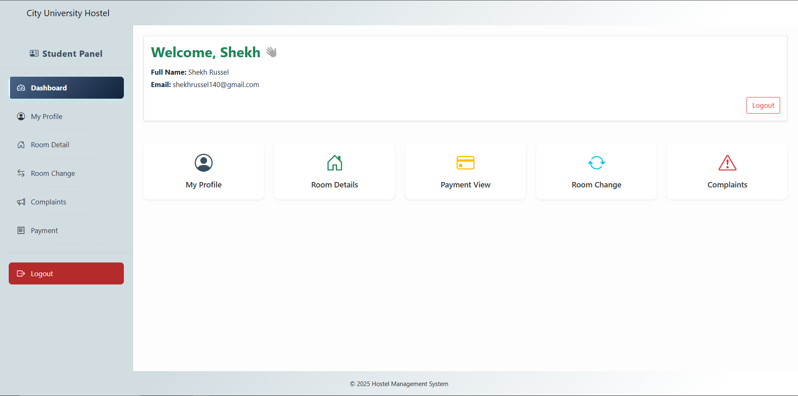

### 🧾 Payment Section

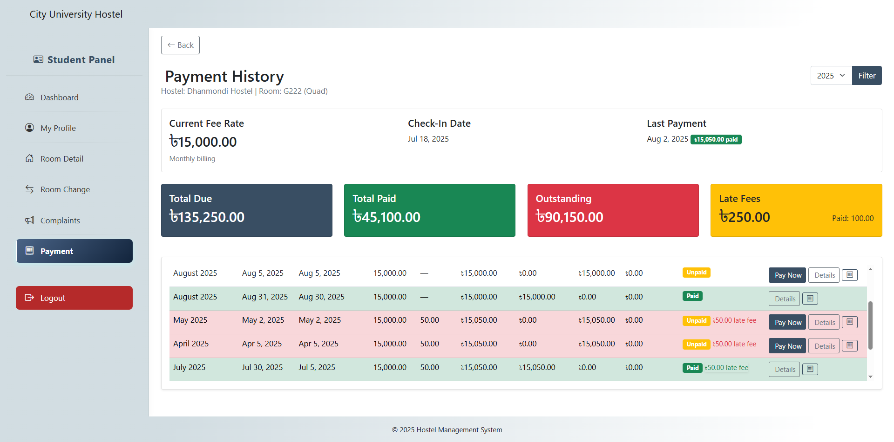
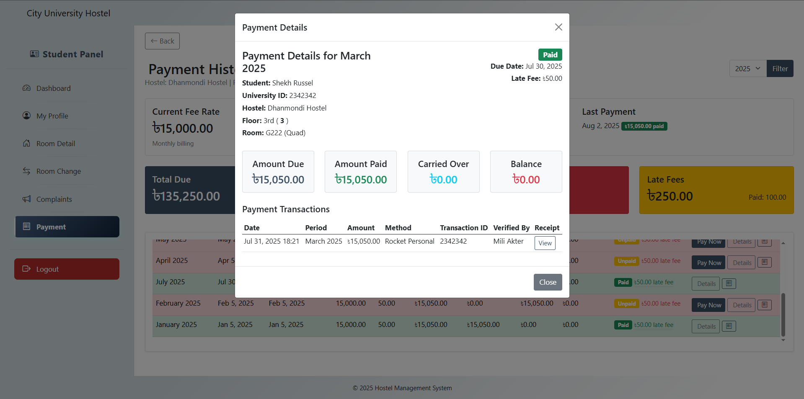

### 📢 Complaint Section

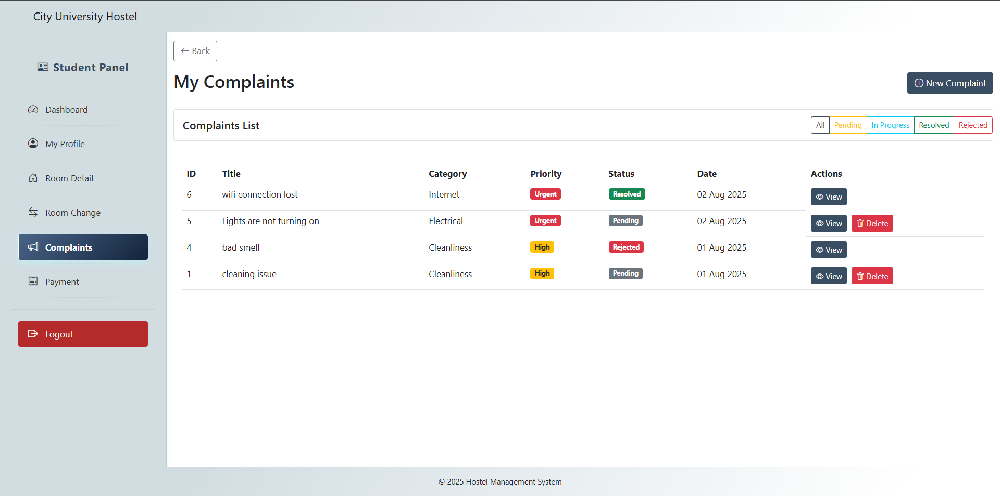

### Room Change Request

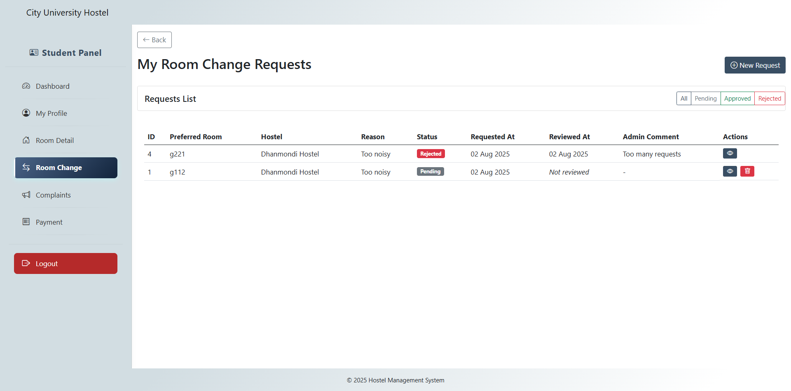

### xProfile

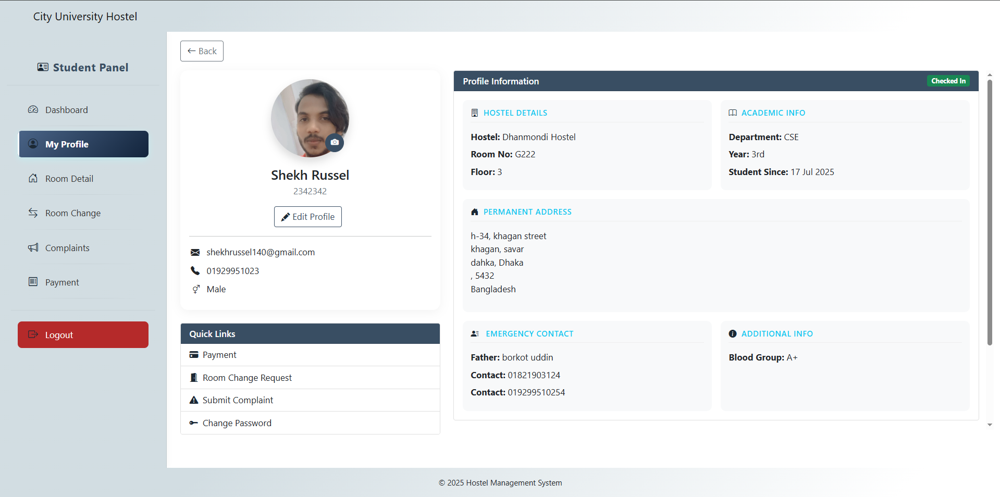

### Room Detail

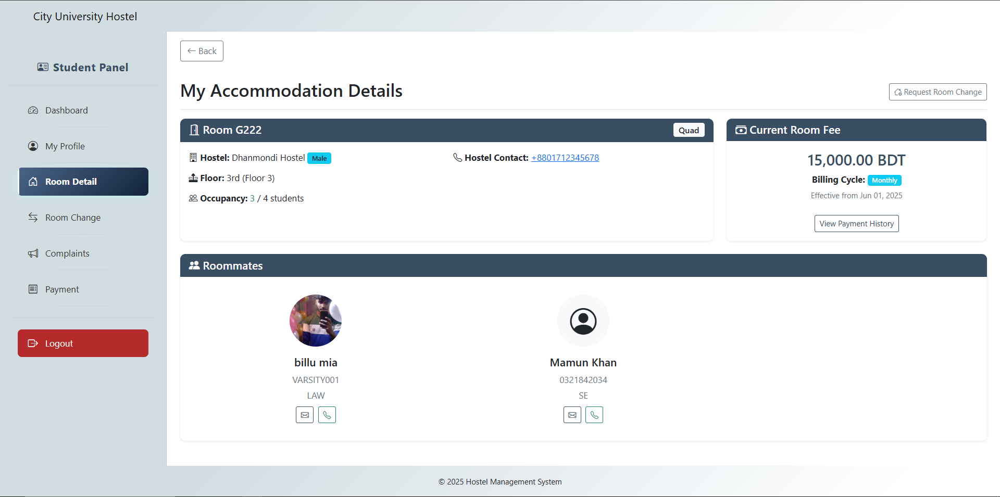

### Monthly payment Report

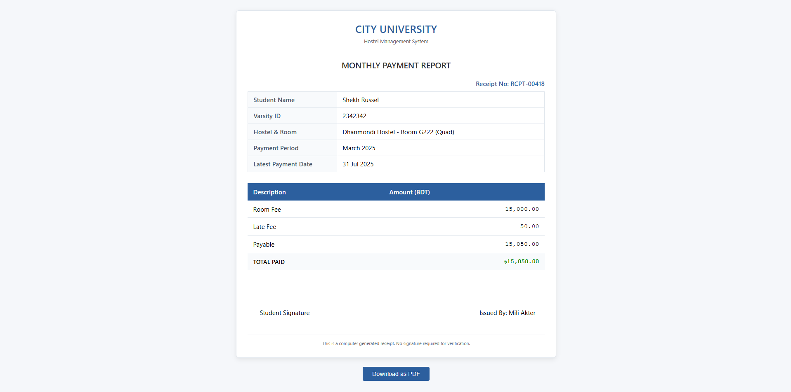

---

### 👨‍💼 Admin Dashboard

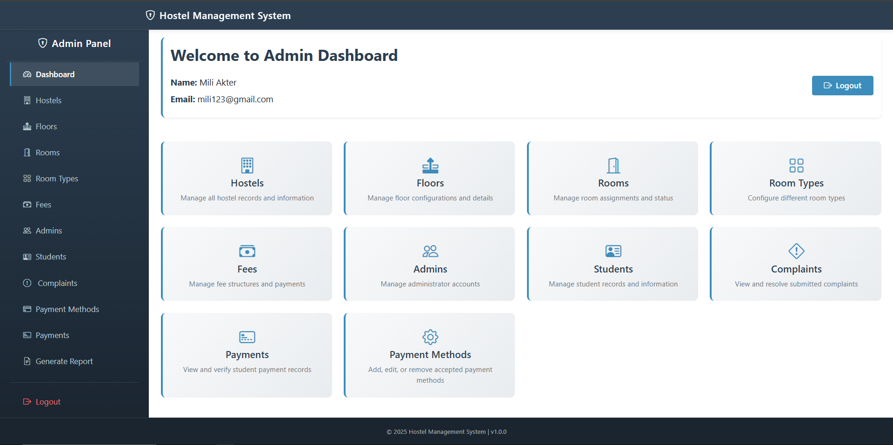

### 🏢 Payment Generation

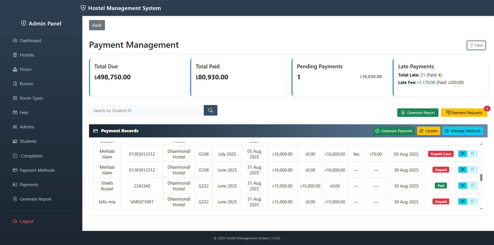
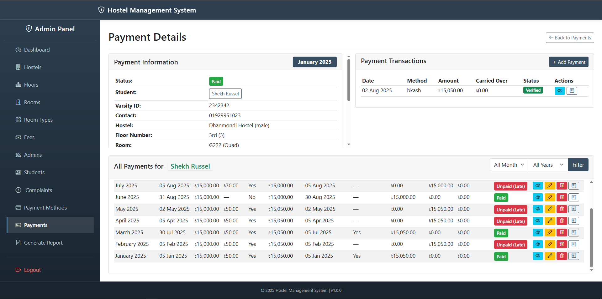

### 💰 Payment Generation & Report

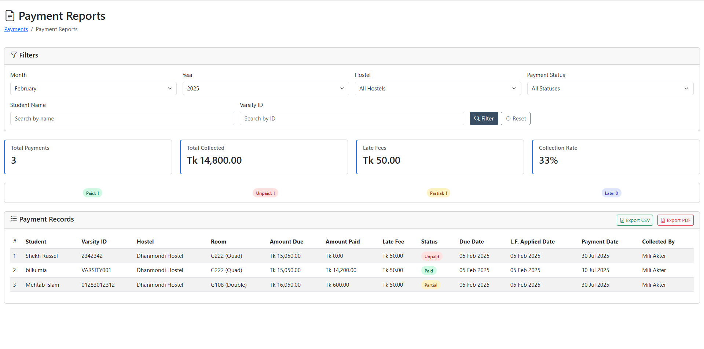

### Complaints

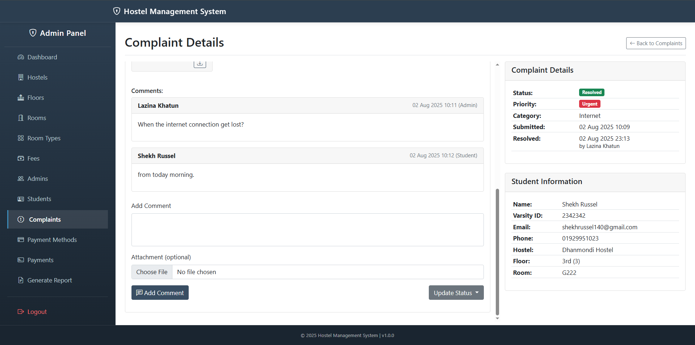

### Managing Students

### Role-Based Error Page for Invalid or Unrecognized Routes

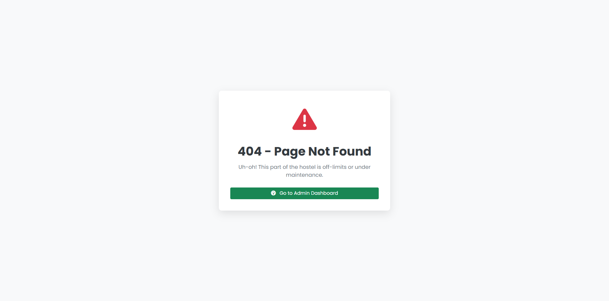

---

## 📧 Contact

connect via email:
mdraselahmed.code@gmail.com

---

## 📜 License

This project is licensed under the MIT License. See the `LICENSE` file for more details.
